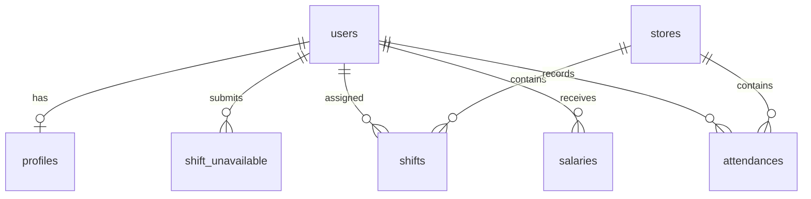

# データベース設計書

**プロジェクト名**: シフト・勤怠・給与管理システム  
**作成日**: 2026年2月4日  
**データベース**: Supabase (PostgreSQL)

---

## 1. ER図



---

## 2. テーブル定義

### 2.1 stores（店舗）

| カラム名 | 型 | NULL | デフォルト | 説明 |
|----------|-----|------|-----------|------|
| id | uuid | NO | gen_random_uuid() | PK |
| name | text | NO | - | 店舗名 |
| code | text | NO | - | 店舗コード（shiki, moday） |
| has_transportation_fee | boolean | NO | false | 交通費支給の有無 |
| created_at | timestamptz | NO | now() | 作成日時 |
| updated_at | timestamptz | NO | now() | 更新日時 |

**初期データ:**
| name | code | has_transportation_fee |
|------|------|------------------------|
| 麺屋四季 | shiki | true |
| RAMEN MODAY | moday | false |

---

### 2.2 profiles（スタッフプロフィール）

| カラム名 | 型 | NULL | デフォルト | 説明 |
|----------|-----|------|-----------|------|
| id | uuid | NO | - | PK, FK → auth.users.id |
| name | text | NO | - | 氏名 |
| role | text | NO | 'staff' | 権限（staff / admin） |
| hourly_wage | integer | NO | 1000 | 時給（円） |
| transportation_fee | integer | YES | NULL | 交通費/回（円）※麺屋四季のみ |
| is_active | boolean | NO | true | 有効フラグ |
| created_at | timestamptz | NO | now() | 作成日時 |
| updated_at | timestamptz | NO | now() | 更新日時 |

**インデックス:**
- `profiles_role_idx` ON (role)

---

### 2.3 shift_unavailable（出勤不可日）

| カラム名 | 型 | NULL | デフォルト | 説明 |
|----------|-----|------|-----------|------|
| id | uuid | NO | gen_random_uuid() | PK |
| user_id | uuid | NO | - | FK → profiles.id |
| unavailable_date | date | NO | - | 出勤できない日 |
| created_at | timestamptz | NO | now() | 作成日時 |

**ユニーク制約:**
- `shift_unavailable_user_date_unique` ON (user_id, unavailable_date)

**インデックス:**
- `shift_unavailable_date_idx` ON (unavailable_date)

---

### 2.4 shifts（確定シフト）

| カラム名 | 型 | NULL | デフォルト | 説明 |
|----------|-----|------|-----------|------|
| id | uuid | NO | gen_random_uuid() | PK |
| user_id | uuid | NO | - | FK → profiles.id |
| store_id | uuid | NO | - | FK → stores.id |
| shift_date | date | NO | - | シフト日 |
| created_at | timestamptz | NO | now() | 作成日時 |
| updated_at | timestamptz | NO | now() | 更新日時 |

**ユニーク制約:**
- `shifts_user_store_date_unique` ON (user_id, store_id, shift_date)

**インデックス:**
- `shifts_date_idx` ON (shift_date)
- `shifts_user_id_idx` ON (user_id)
- `shifts_store_id_idx` ON (store_id)

---

### 2.5 attendances（勤怠記録）

| カラム名 | 型 | NULL | デフォルト | 説明 |
|----------|-----|------|-----------|------|
| id | uuid | NO | gen_random_uuid() | PK |
| user_id | uuid | NO | - | FK → profiles.id |
| store_id | uuid | NO | - | FK → stores.id |
| work_date | date | NO | - | 勤務日 |
| clock_in | timestamptz | YES | NULL | 出勤時刻 |
| break_start | timestamptz | YES | NULL | 休憩開始時刻 |
| break_end | timestamptz | YES | NULL | 休憩終了時刻 |
| clock_out | timestamptz | YES | NULL | 退勤時刻 |
| work_minutes | integer | YES | NULL | 実働時間（分）※自動計算 |
| break_minutes | integer | YES | NULL | 休憩時間（分）※自動計算 |
| memo | text | YES | NULL | メモ（修正理由など） |
| created_at | timestamptz | NO | now() | 作成日時 |
| updated_at | timestamptz | NO | now() | 更新日時 |

**ユニーク制約:**
- `attendances_user_store_date_unique` ON (user_id, store_id, work_date)

**インデックス:**
- `attendances_work_date_idx` ON (work_date)
- `attendances_user_id_idx` ON (user_id)
- `attendances_store_id_idx` ON (store_id)

---

### 2.6 salaries（給与）

| カラム名 | 型 | NULL | デフォルト | 説明 |
|----------|-----|------|-----------|------|
| id | uuid | NO | gen_random_uuid() | PK |
| user_id | uuid | NO | - | FK → profiles.id |
| year_month | text | NO | - | 対象年月（YYYY-MM） |
| total_work_minutes | integer | NO | 0 | 総勤務時間（分） |
| total_break_minutes | integer | NO | 0 | 総休憩時間（分） |
| hourly_wage | integer | NO | - | 時給（計算時点） |
| work_days_shiki | integer | NO | 0 | 麺屋四季の勤務日数 |
| transportation_fee_per_day | integer | NO | 0 | 交通費/回（計算時点） |
| base_salary | integer | NO | 0 | 基本給（時給×時間） |
| transportation_total | integer | NO | 0 | 交通費合計 |
| total_salary | integer | NO | 0 | 総支給額 |
| is_confirmed | boolean | NO | false | 確定フラグ |
| created_at | timestamptz | NO | now() | 作成日時 |
| updated_at | timestamptz | NO | now() | 更新日時 |

**ユニーク制約:**
- `salaries_user_month_unique` ON (user_id, year_month)

**インデックス:**
- `salaries_year_month_idx` ON (year_month)
- `salaries_user_id_idx` ON (user_id)

---

## 3. Row Level Security (RLS) ポリシー

### 3.1 profiles

```sql
-- スタッフ: 自分のプロフィールのみ閲覧・編集可
-- 管理者: 全スタッフのプロフィールを閲覧・編集可

CREATE POLICY "Users can view own profile"
  ON profiles FOR SELECT
  USING (auth.uid() = id);

CREATE POLICY "Admins can view all profiles"
  ON profiles FOR SELECT
  USING (
    EXISTS (
      SELECT 1 FROM profiles
      WHERE id = auth.uid() AND role = 'admin'
    )
  );

CREATE POLICY "Admins can update all profiles"
  ON profiles FOR UPDATE
  USING (
    EXISTS (
      SELECT 1 FROM profiles
      WHERE id = auth.uid() AND role = 'admin'
    )
  );
```

### 3.2 shift_unavailable

```sql
-- スタッフ: 自分の出勤不可日を追加・閲覧・削除可
-- 管理者: 全スタッフの出勤不可日を閲覧可

CREATE POLICY "Users can manage own unavailable dates"
  ON shift_unavailable FOR ALL
  USING (auth.uid() = user_id);

CREATE POLICY "Admins can view all unavailable dates"
  ON shift_unavailable FOR SELECT
  USING (
    EXISTS (
      SELECT 1 FROM profiles
      WHERE id = auth.uid() AND role = 'admin'
    )
  );
```

### 3.3 shifts

```sql
-- 全員: シフト閲覧可
-- 管理者のみ: シフト作成・編集・削除可

CREATE POLICY "Everyone can view shifts"
  ON shifts FOR SELECT
  USING (true);

CREATE POLICY "Admins can manage shifts"
  ON shifts FOR ALL
  USING (
    EXISTS (
      SELECT 1 FROM profiles
      WHERE id = auth.uid() AND role = 'admin'
    )
  );
```

### 3.4 attendances

```sql
-- スタッフ: 自分の勤怠を閲覧・編集可
-- 管理者: 全スタッフの勤怠を閲覧・編集可

CREATE POLICY "Users can manage own attendances"
  ON attendances FOR ALL
  USING (auth.uid() = user_id);

CREATE POLICY "Admins can manage all attendances"
  ON attendances FOR ALL
  USING (
    EXISTS (
      SELECT 1 FROM profiles
      WHERE id = auth.uid() AND role = 'admin'
    )
  );
```

### 3.5 salaries

```sql
-- スタッフ: 自分の給与のみ閲覧可
-- 管理者: 全スタッフの給与を閲覧・編集可

CREATE POLICY "Users can view own salaries"
  ON salaries FOR SELECT
  USING (auth.uid() = user_id);

CREATE POLICY "Admins can manage all salaries"
  ON salaries FOR ALL
  USING (
    EXISTS (
      SELECT 1 FROM profiles
      WHERE id = auth.uid() AND role = 'admin'
    )
  );
```

---

## 4. Database Functions

### 4.1 勤務時間自動計算トリガー

```sql
CREATE OR REPLACE FUNCTION calculate_work_minutes()
RETURNS TRIGGER AS $$
BEGIN
  -- 退勤・休憩終了が記録されたら自動計算
  IF NEW.clock_in IS NOT NULL AND NEW.clock_out IS NOT NULL THEN
    -- 総勤務時間（分）
    NEW.work_minutes := EXTRACT(EPOCH FROM (NEW.clock_out - NEW.clock_in)) / 60;
    
    -- 休憩時間（分）
    IF NEW.break_start IS NOT NULL AND NEW.break_end IS NOT NULL THEN
      NEW.break_minutes := EXTRACT(EPOCH FROM (NEW.break_end - NEW.break_start)) / 60;
      NEW.work_minutes := NEW.work_minutes - NEW.break_minutes;
    END IF;
  END IF;
  
  NEW.updated_at := now();
  RETURN NEW;
END;
$$ LANGUAGE plpgsql;

CREATE TRIGGER attendance_calculate_minutes
  BEFORE INSERT OR UPDATE ON attendances
  FOR EACH ROW
  EXECUTE FUNCTION calculate_work_minutes();
```

### 4.2 updated_at 自動更新トリガー

```sql
CREATE OR REPLACE FUNCTION update_updated_at()
RETURNS TRIGGER AS $$
BEGIN
  NEW.updated_at := now();
  RETURN NEW;
END;
$$ LANGUAGE plpgsql;

-- 各テーブルに適用
CREATE TRIGGER update_stores_updated_at
  BEFORE UPDATE ON stores
  FOR EACH ROW EXECUTE FUNCTION update_updated_at();

CREATE TRIGGER update_profiles_updated_at
  BEFORE UPDATE ON profiles
  FOR EACH ROW EXECUTE FUNCTION update_updated_at();

CREATE TRIGGER update_shifts_updated_at
  BEFORE UPDATE ON shifts
  FOR EACH ROW EXECUTE FUNCTION update_updated_at();

CREATE TRIGGER update_salaries_updated_at
  BEFORE UPDATE ON salaries
  FOR EACH ROW EXECUTE FUNCTION update_updated_at();
```

---

## 5. ビュー

### 5.1 月次勤怠サマリー

```sql
CREATE VIEW monthly_attendance_summary AS
SELECT
  a.user_id,
  p.name AS user_name,
  TO_CHAR(a.work_date, 'YYYY-MM') AS year_month,
  s.code AS store_code,
  s.name AS store_name,
  COUNT(*) AS work_days,
  SUM(a.work_minutes) AS total_work_minutes,
  SUM(a.break_minutes) AS total_break_minutes
FROM attendances a
JOIN profiles p ON a.user_id = p.id
JOIN stores s ON a.store_id = s.id
WHERE a.clock_out IS NOT NULL
GROUP BY a.user_id, p.name, TO_CHAR(a.work_date, 'YYYY-MM'), s.code, s.name;
```

### 5.2 給与計算用ビュー

```sql
CREATE VIEW salary_calculation AS
SELECT
  p.id AS user_id,
  p.name AS user_name,
  p.hourly_wage,
  p.transportation_fee,
  m.year_month,
  COALESCE(shiki.work_days, 0) AS shiki_work_days,
  COALESCE(moday.work_days, 0) AS moday_work_days,
  COALESCE(shiki.total_work_minutes, 0) + COALESCE(moday.total_work_minutes, 0) AS total_work_minutes,
  COALESCE(shiki.total_break_minutes, 0) + COALESCE(moday.total_break_minutes, 0) AS total_break_minutes
FROM profiles p
CROSS JOIN (
  SELECT DISTINCT TO_CHAR(work_date, 'YYYY-MM') AS year_month
  FROM attendances
) m
LEFT JOIN monthly_attendance_summary shiki
  ON p.id = shiki.user_id
  AND m.year_month = shiki.year_month
  AND shiki.store_code = 'shiki'
LEFT JOIN monthly_attendance_summary moday
  ON p.id = moday.user_id
  AND m.year_month = moday.year_month
  AND moday.store_code = 'moday'
WHERE p.is_active = true;
```

---

## 6. マイグレーションSQL

> [!IMPORTANT]
> 以下のSQLをSupabase SQL Editorで実行してください

```sql
-- ========================================
-- 1. テーブル作成
-- ========================================

-- stores
CREATE TABLE stores (
  id uuid PRIMARY KEY DEFAULT gen_random_uuid(),
  name text NOT NULL,
  code text NOT NULL UNIQUE,
  has_transportation_fee boolean NOT NULL DEFAULT false,
  created_at timestamptz NOT NULL DEFAULT now(),
  updated_at timestamptz NOT NULL DEFAULT now()
);

-- profiles
CREATE TABLE profiles (
  id uuid PRIMARY KEY REFERENCES auth.users(id) ON DELETE CASCADE,
  name text NOT NULL,
  role text NOT NULL DEFAULT 'staff' CHECK (role IN ('staff', 'admin')),
  hourly_wage integer NOT NULL DEFAULT 1000,
  transportation_fee integer,
  is_active boolean NOT NULL DEFAULT true,
  created_at timestamptz NOT NULL DEFAULT now(),
  updated_at timestamptz NOT NULL DEFAULT now()
);

-- shift_unavailable
CREATE TABLE shift_unavailable (
  id uuid PRIMARY KEY DEFAULT gen_random_uuid(),
  user_id uuid NOT NULL REFERENCES profiles(id) ON DELETE CASCADE,
  unavailable_date date NOT NULL,
  created_at timestamptz NOT NULL DEFAULT now(),
  UNIQUE (user_id, unavailable_date)
);

-- shifts
CREATE TABLE shifts (
  id uuid PRIMARY KEY DEFAULT gen_random_uuid(),
  user_id uuid NOT NULL REFERENCES profiles(id) ON DELETE CASCADE,
  store_id uuid NOT NULL REFERENCES stores(id) ON DELETE CASCADE,
  shift_date date NOT NULL,
  created_at timestamptz NOT NULL DEFAULT now(),
  updated_at timestamptz NOT NULL DEFAULT now(),
  UNIQUE (user_id, store_id, shift_date)
);

-- attendances
CREATE TABLE attendances (
  id uuid PRIMARY KEY DEFAULT gen_random_uuid(),
  user_id uuid NOT NULL REFERENCES profiles(id) ON DELETE CASCADE,
  store_id uuid NOT NULL REFERENCES stores(id) ON DELETE CASCADE,
  work_date date NOT NULL,
  clock_in timestamptz,
  break_start timestamptz,
  break_end timestamptz,
  clock_out timestamptz,
  work_minutes integer,
  break_minutes integer,
  memo text,
  created_at timestamptz NOT NULL DEFAULT now(),
  updated_at timestamptz NOT NULL DEFAULT now(),
  UNIQUE (user_id, store_id, work_date)
);

-- salaries
CREATE TABLE salaries (
  id uuid PRIMARY KEY DEFAULT gen_random_uuid(),
  user_id uuid NOT NULL REFERENCES profiles(id) ON DELETE CASCADE,
  year_month text NOT NULL,
  total_work_minutes integer NOT NULL DEFAULT 0,
  total_break_minutes integer NOT NULL DEFAULT 0,
  hourly_wage integer NOT NULL,
  work_days_shiki integer NOT NULL DEFAULT 0,
  transportation_fee_per_day integer NOT NULL DEFAULT 0,
  base_salary integer NOT NULL DEFAULT 0,
  transportation_total integer NOT NULL DEFAULT 0,
  total_salary integer NOT NULL DEFAULT 0,
  is_confirmed boolean NOT NULL DEFAULT false,
  created_at timestamptz NOT NULL DEFAULT now(),
  updated_at timestamptz NOT NULL DEFAULT now(),
  UNIQUE (user_id, year_month)
);

-- ========================================
-- 2. インデックス作成
-- ========================================

CREATE INDEX profiles_role_idx ON profiles(role);
CREATE INDEX shift_unavailable_date_idx ON shift_unavailable(unavailable_date);
CREATE INDEX shifts_date_idx ON shifts(shift_date);
CREATE INDEX shifts_user_id_idx ON shifts(user_id);
CREATE INDEX shifts_store_id_idx ON shifts(store_id);
CREATE INDEX attendances_work_date_idx ON attendances(work_date);
CREATE INDEX attendances_user_id_idx ON attendances(user_id);
CREATE INDEX attendances_store_id_idx ON attendances(store_id);
CREATE INDEX salaries_year_month_idx ON salaries(year_month);
CREATE INDEX salaries_user_id_idx ON salaries(user_id);

-- ========================================
-- 3. 初期データ
-- ========================================

INSERT INTO stores (name, code, has_transportation_fee) VALUES
  ('麺屋四季', 'shiki', true),
  ('RAMEN MODAY', 'moday', false);

-- ========================================
-- 4. RLS有効化
-- ========================================

ALTER TABLE stores ENABLE ROW LEVEL SECURITY;
ALTER TABLE profiles ENABLE ROW LEVEL SECURITY;
ALTER TABLE shift_unavailable ENABLE ROW LEVEL SECURITY;
ALTER TABLE shifts ENABLE ROW LEVEL SECURITY;
ALTER TABLE attendances ENABLE ROW LEVEL SECURITY;
ALTER TABLE salaries ENABLE ROW LEVEL SECURITY;

-- stores: 全員閲覧可、管理者は編集可
CREATE POLICY "Everyone can view stores" ON stores FOR SELECT USING (true);
CREATE POLICY "Admins can manage stores" ON stores FOR ALL
  USING (EXISTS (SELECT 1 FROM profiles WHERE id = auth.uid() AND role = 'admin'));

-- profiles
CREATE POLICY "Users can view own profile" ON profiles FOR SELECT
  USING (auth.uid() = id);
CREATE POLICY "Admins can view all profiles" ON profiles FOR SELECT
  USING (EXISTS (SELECT 1 FROM profiles WHERE id = auth.uid() AND role = 'admin'));
CREATE POLICY "Admins can insert profiles" ON profiles FOR INSERT
  WITH CHECK (EXISTS (SELECT 1 FROM profiles WHERE id = auth.uid() AND role = 'admin'));
CREATE POLICY "Admins can update profiles" ON profiles FOR UPDATE
  USING (EXISTS (SELECT 1 FROM profiles WHERE id = auth.uid() AND role = 'admin'));

-- shift_unavailable
CREATE POLICY "Users can manage own unavailable" ON shift_unavailable FOR ALL
  USING (auth.uid() = user_id);
CREATE POLICY "Admins can view all unavailable" ON shift_unavailable FOR SELECT
  USING (EXISTS (SELECT 1 FROM profiles WHERE id = auth.uid() AND role = 'admin'));

-- shifts
CREATE POLICY "Everyone can view shifts" ON shifts FOR SELECT USING (true);
CREATE POLICY "Admins can manage shifts" ON shifts FOR ALL
  USING (EXISTS (SELECT 1 FROM profiles WHERE id = auth.uid() AND role = 'admin'));

-- attendances
CREATE POLICY "Users can manage own attendances" ON attendances FOR ALL
  USING (auth.uid() = user_id);
CREATE POLICY "Admins can manage all attendances" ON attendances FOR ALL
  USING (EXISTS (SELECT 1 FROM profiles WHERE id = auth.uid() AND role = 'admin'));

-- salaries
CREATE POLICY "Users can view own salaries" ON salaries FOR SELECT
  USING (auth.uid() = user_id);
CREATE POLICY "Admins can manage all salaries" ON salaries FOR ALL
  USING (EXISTS (SELECT 1 FROM profiles WHERE id = auth.uid() AND role = 'admin'));
```

---

## 7. Supabase設定

### 7.1 認証設定

1. **Authentication > Providers** で Email を有効化
2. **Authentication > URL Configuration** でサイトURLを設定

### 7.2 新規ユーザー登録時のプロフィール自動作成

```sql
-- auth.usersに新規ユーザーが作成されたらprofilesにも自動作成
CREATE OR REPLACE FUNCTION public.handle_new_user()
RETURNS TRIGGER AS $$
BEGIN
  INSERT INTO public.profiles (id, name, role)
  VALUES (
    NEW.id,
    COALESCE(NEW.raw_user_meta_data->>'name', NEW.email),
    COALESCE(NEW.raw_user_meta_data->>'role', 'staff')
  );
  RETURN NEW;
END;
$$ LANGUAGE plpgsql SECURITY DEFINER;

CREATE TRIGGER on_auth_user_created
  AFTER INSERT ON auth.users
  FOR EACH ROW
  EXECUTE FUNCTION public.handle_new_user();
```
