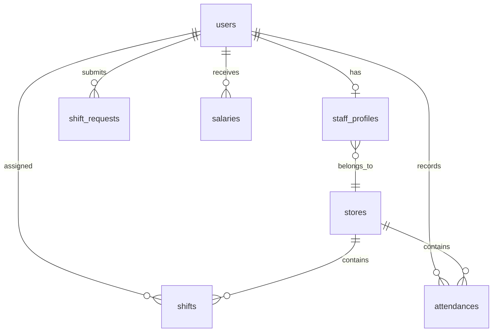

# 要件定義書

**プロジェクト名**: シフト・勤怠・給与管理システム  
**作成日**: 2026年2月4日  
**バージョン**: 1.0

---

## 1. プロジェクト概要

### 1.1 目的
麺屋四季とRAMEN MODAYの2店舗を運営する飲食店向けに、シフト提出・勤怠管理・給与管理を一元化したWebアプリケーションを開発する。

### 1.2 技術スタック

| 項目 | 技術 |
|------|------|
| フレームワーク | Next.js (App Router) |
| デプロイ | Vercel |
| データベース | Supabase |
| 認証 | Supabase Auth |

---

## 2. ユーザー要件

### 2.1 ユーザー種別

| 種別 | 説明 |
|------|------|
| **一般スタッフ** | シフト希望の提出、勤怠の打刻を行う |
| **管理者（店長）** | 全機能へのアクセス、シフト確定、給与計算・管理 |

### 2.2 規模

- スタッフ数: 約20名
- 店舗数: 2店舗
  - **麺屋四季** ※交通費あり
  - **RAMEN MODAY** ※交通費なし

### 2.3 特記事項

- 両店舗の店長は同一人物
- 給与計算は2店舗合算で行う
- 打刻ページは店舗ごとに分離する

---

## 3. 機能要件

### 3.1 認証機能

| 機能 | 説明 |
|------|------|
| ログイン | メールアドレス + パスワードでログイン |
| ログアウト | セッション終了 |
| ユーザー登録 | 管理者のみがスタッフを登録可能 |

---

### 3.2 シフト管理機能

#### 3.2.1 基本仕様

- 基本出勤日: **月曜日・金曜日**
- 提出形式: **出勤できない日を提出**（ネガティブ方式）

#### 3.2.2 一般スタッフ向け

| 機能 | 説明 |
|------|------|
| 出勤不可日の提出 | カレンダーUIで出勤できない日を選択・提出 |
| 確定シフトの閲覧 | 自分および他スタッフの確定シフトを閲覧 |

#### 3.2.3 管理者向け

| 機能 | 説明 |
|------|------|
| 提出状況の確認 | 全スタッフの出勤不可日を一覧表示 |
| シフトの確定 | 各スタッフのシフトを確定・公開 |
| シフトの編集 | 確定後のシフト変更 |

---

### 3.3 勤怠管理機能

#### 3.3.1 打刻機能

| 操作 | 説明 |
|------|------|
| 出勤 | ボタン押下で出勤時刻を記録 |
| 休憩開始 | ボタン押下で休憩開始時刻を記録 |
| 休憩終了 | ボタン押下で休憩終了時刻を記録 |
| 退勤 | ボタン押下で退勤時刻を記録 |

#### 3.3.2 打刻ページ

- 店舗ごとに別々のページを用意
  - `/attendance/shiki` （麺屋四季）
  - `/attendance/moday` （RAMEN MODAY）

#### 3.3.3 打刻修正

| 対象 | 権限 |
|------|------|
| 一般スタッフ | 自分の打刻を即時編集可能 |
| 管理者 | 全スタッフの打刻を編集可能 |

#### 3.3.4 その他仕様

- 残業計算: **なし**
- 不正打刻対策: **なし**
- 休暇申請機能: **なし**

---

### 3.4 給与管理機能

#### 3.4.1 基本仕様

| 項目 | 内容 |
|------|------|
| 給与形態 | 時給制 |
| 締め日 | 月末 |
| 支払日 | 翌月10日（手渡し） |
| 深夜・休日手当 | なし |
| 税金・社会保険控除 | なし（対象外） |

#### 3.4.2 交通費

| 店舗 | 交通費 |
|------|--------|
| 麺屋四季 | あり（**実費**をスタッフごとに設定） |
| RAMEN MODAY | なし |

#### 3.4.3 給与計算

- 2店舗の勤務時間を合算
- 時給は**スタッフ×店舗ごとに設定**
- 計算式: `店舗ごとの勤務時間 × 店舗別時給` の合計 + 交通費

#### 3.4.4 出力機能

| 機能 | 説明 |
|------|------|
| 給与明細PDF | スタッフ別に月次給与明細をPDF出力 |

---

### 3.5 ダッシュボード

#### 3.5.1 一般スタッフ向け

| 表示項目 | 説明 |
|----------|------|
| 今月の給与見込み | 現時点の勤務時間から計算した給与 |
| シフト一覧 | 直近のシフト表示 |
| 勤務時間サマリー | 今月の総勤務時間 |

#### 3.5.2 管理者向け

| 表示項目 | 説明 |
|----------|------|
| 全スタッフ給与一覧 | 今月の給与サマリー |
| 人件費推移 | 月別人件費のグラフ表示 |
| シフト一覧 | 全スタッフのシフト表示 |
| 打刻状況 | 本日の出勤状況 |

---

## 4. 画面一覧

### 4.1 共通画面

| 画面名 | パス | 説明 |
|--------|------|------|
| ログイン | `/login` | 認証画面 |
| ダッシュボード | `/dashboard` | メイン画面 |

### 4.2 シフト関連

| 画面名 | パス | 権限 | 説明 |
|--------|------|------|------|
| シフト提出 | `/shift/submit` | スタッフ | 出勤不可日を提出 |
| シフト確認 | `/shift/view` | 全員 | 確定シフトを閲覧 |
| シフト管理 | `/shift/manage` | 管理者 | シフト確定・編集 |

### 4.3 勤怠関連

| 画面名 | パス | 権限 | 説明 |
|--------|------|------|------|
| 打刻（麺屋四季） | `/attendance/shiki` | 全員 | 打刻操作 |
| 打刻（RAMEN MODAY） | `/attendance/moday` | 全員 | 打刻操作 |
| 勤怠履歴 | `/attendance/history` | 全員 | 自分の勤怠確認・修正 |
| 勤怠管理 | `/attendance/manage` | 管理者 | 全スタッフの勤怠管理 |

### 4.4 給与関連

| 画面名 | パス | 権限 | 説明 |
|--------|------|------|------|
| 給与確認 | `/salary/view` | スタッフ | 自分の給与確認 |
| 給与管理 | `/salary/manage` | 管理者 | 全スタッフの給与管理・PDF出力 |

### 4.5 設定関連

| 画面名 | パス | 権限 | 説明 |
|--------|------|------|------|
| スタッフ管理 | `/settings/staff` | 管理者 | スタッフ登録・編集・削除 |
| 店舗設定 | `/settings/stores` | 管理者 | 店舗情報・時給設定 |

---

## 5. データモデル（概要）

### 5.1 テーブル一覧

```
users           - ユーザー情報
stores          - 店舗情報
staff_profiles  - スタッフ詳細情報（基本情報、店舗別時給、交通費など）
shift_requests  - シフト希望（出勤不可日）
shifts          - 確定シフト
attendances     - 勤怠記録
salaries        - 給与計算結果
```

### 5.2 ER図（概念）



---

## 6. 非機能要件

### 6.1 パフォーマンス

- ページ読み込み: 3秒以内
- 打刻操作: 1秒以内にレスポンス

### 6.2 セキュリティ

- Supabase RLSによる行レベルセキュリティ
- 認証必須（ログインページ以外）

### 6.3 対応デバイス

- PC（Chrome, Firefox, Safari, Edge）
- スマートフォン（レスポンシブ対応）

---

## 7. 将来的な拡張（Phase 2以降）

> [!NOTE]
> 以下は初期リリースには含めないが、将来的に追加可能な機能

- 通知機能（シフト確定通知、打刻忘れアラート）
- LINE連携
- 税金・社会保険控除計算
- 深夜手当・休日手当
- 他店舗の追加対応

---

## 8. 用語集

| 用語 | 説明 |
|------|------|
| シフト希望 | スタッフが提出する出勤不可日の情報 |
| 確定シフト | 管理者が確定した最終的なシフト |
| 打刻 | 出勤・休憩・退勤の時刻記録 |
| 締め日 | 給与計算の対象期間の最終日（月末） |
